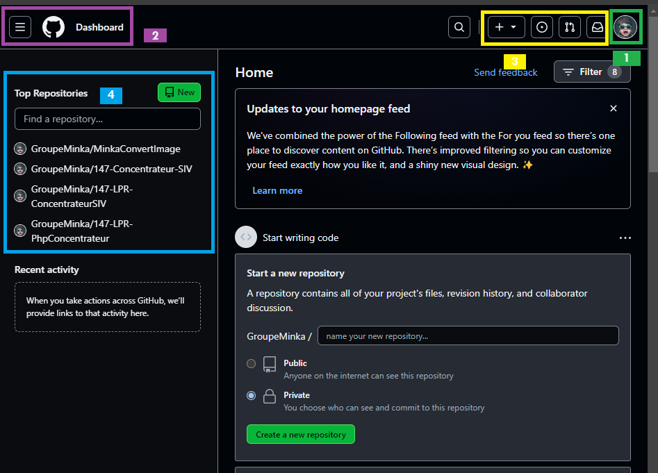
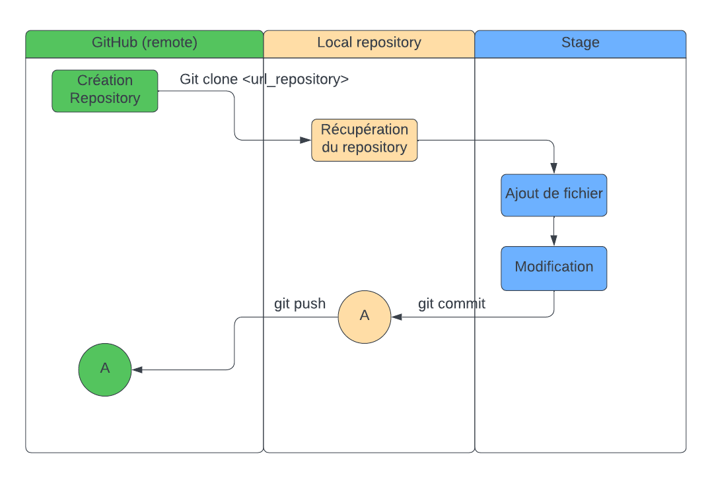

# Présentation de GitHub

## Les termes GIT à connaitre
1. Repository (Dépôt) : Un dépôt Git est un espace où sont stockées toutes les versions des fichiers, ainsi que l'historique des modifications. Il peut être local (sur votre ordinateur) ou distant (sur un serveur).
2. Remote (Dépôt distant) : Un dépôt distant est une copie du dépôt local située sur un serveur distant tel que GitHub, GitLab ou Bitbucket. Cela permet le partage du code entre plusieurs contributeurs.
3. Clone : Cloner un dépôt Git signifie créer une copie locale complète d'un dépôt distant, permettant à un développeur de travailler sur une copie du projet.
4. Commit : Un commit représente une modification spécifique apportée à un ou plusieurs fichiers dans un dépôt Git. Chaque commit est accompagné d'un message descriptif pour expliquer les changements effectués.
5. Pull : Pull signifie récupérer les modifications d'un dépôt distant vers votre dépôt local.
6. Push : Push signifie envoyer vos commits locaux vers un dépôt distant, mettant à jour les modifications sur le serveur.
7. Pull Request : Une pull request est une demande envoyée par un développeur pour fusionner les modifications qu'il a effectuées dans une branche vers une autre branche, généralement la branche principale. Les pull requests sont examinées et approuvées par les pairs avant d'être fusionnées.
8. Branch (Branche) : Une branche est une version parallèle du code source principal (habituellement appelée "branche principale" ou "branche master"). Les branches permettent de travailler sur des fonctionnalités isolées ou des corrections de bugs sans perturber le code principal. Elles peuvent être fusionnées plus tard si nécessaire.
9. Merge (Fusion) : La fusion est le processus qui combine les modifications de deux branches différentes pour intégrer l9es changements effectués dans l'une d'entre elles à l'autre.
10. Checkout : Cela permet de passer d'une branche à une autre ou de restaurer des fichiers à une version précédente.
11. Stash : Stash permet de mettre de côté temporairement des modifications non validées dans un espace de stockage en attente. Cela permet de passer rapidement d'une branche à une autre sans commiter des modifications en cours.

## https://github.com

1. Menu "Your Profile" : permet de configurer votre profile (mail, 2FA, SSH Keys, ...)
2. Menu Burger (voir 3. Zone d'actions)
3. Zone d'actions : Créer un repository, voir les "issues" qui vous sont affectés, gerer les "Pulls Request"
4. Liste de vos derniers repositories

## 2 fichiers importants
Dans GitHub, les fichiers README.md et .gitignore sont deux éléments importants pour la gestion des projets et du code source.

### README.md :
Le fichier README.md est un fichier Markdown, généralement présent à la racine d'un repository, qui sert de documentation pour votre projet. Il est souvent la première chose que voient les visiteurs lorsqu'ils accèdent à votre repository sur GitHub. Son objectif principal est de fournir des informations sur votre projet de manière concise et claire. Les utilisations typiques comprennent :

Description du Projet : Une brève description expliquant ce que fait votre projet.
Instructions d'Installation : Les étapes nécessaires pour installer et exécuter votre projet.
Guide d'Utilisation : Des exemples, des captures d'écran ou des démonstrations pour utiliser votre projet.
Contributions et Collaboration : Des directives pour aider les contributeurs à comprendre comment participer et contribuer au projet.
Il est crucial d'écrire un bon README.md pour faciliter la compréhension et l'utilisation de votre projet par d'autres développeurs ou utilisateurs.

### .gitignore :
Le fichier .gitignore est également un élément essentiel dans un repository GitHub. Il spécifie les fichiers et répertoires que Git doit ignorer lorsqu'il suit les modifications dans votre projet. Git suit tous les fichiers à moins qu'ils ne soient explicitement ignorés en utilisant le fichier .gitignore. Cela est particulièrement utile pour exclure des fichiers générés automatiquement, des fichiers de configuration locaux ou sensibles, des fichiers binaires, des fichiers de logs, etc.

Par exemple, si vous utilisez un langage de programmation particulier comme Python, vous pouvez créer un fichier .gitignore contenant des règles pour ignorer les fichiers de compilation, les fichiers de cache, les fichiers d'environnement virtuel, etc. Cela garantit que ces fichiers ne sont pas inclus accidentellement dans les commits et les pushs.

Un fichier .gitignore bien configuré peut aider à maintenir votre repository propre en évitant d'inclure des fichiers inutiles ou sensibles.

## Comment travaille Git ?
