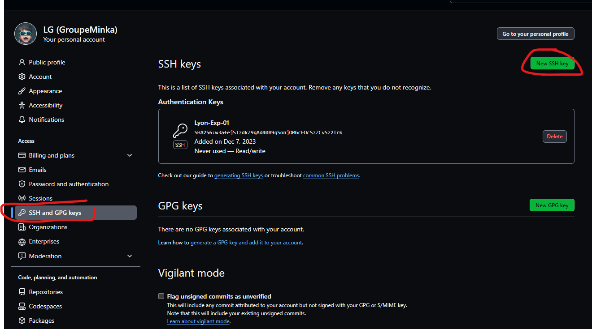

# VSCode - Visual Studio Code

## À quoi sert Visual Studio Code ?
Visual Studio Code est un éditeur de code qui gère le débogage, l’exécution de tâches et le contrôle de version (avec Git). Il vise à fournir les outils dont un développeur a besoin pour développer plus rapidement et efficacement. VSCode est léger et simple, avec juste les outils dont vous aurez besoin, c’est pour ça qu’il est considéré comme un éditeur de code pas un IDE.

## Quelle est la différence entre Visual Studio et Visual Studio Code ?
Visual Studio est un IDE complet et payant alors que Visual Studio Code est un éditeur de code gratuit et open-source.


## Qui utilise Visual Studio Code ?
VS Code est de loin l’éditeur le plus utilisé par les développeurs JavaScript et le web en général. L’éditeur est codé en JavaScript pour le web mais les différentes extensions l’ont également rendu populaire chez les développeurs Python, Ruby, PHP, Go et bien d’autres. En 2023, c’est l’éditeur le plus utilisé chez les développeurs.

## installation VS Code
1. Pour commencer, il faut se rendre sur cette page : https://code.visualstudio.com/download.
2. Puis téléchargez la version pour Windows User Installer en fonction de votre processeur : 64-bit, 32-bit ou ARM.

3. Une fois le téléchargement fini :
- Exécutez l'installateur.
- Acceptez la licence.
- Choisissez le répertoire d'installation.
- Choisissez les fonctionnalités suppélentaires à ajouter.
- Cliquez sur install pour finaliser l'installation.

## Créer une clé SSH
1. Lors de la création de votre compte GitHub, vous avez fourni un mot de passe
2. Pour chaque action git sur le serveur GitHub, l'authentification est obligatoire.
3. La clé SSH générée sur votre pc, à partir de votre profil utilisateur, permet d'automatiser l'authetification.

### Vérifier que le client SSH est installé sur votre pc
1. ouvrir une console PowerShell en tant qu'administrateur
2. Taper la commande :
```PowerShell
 Get-WindowsCapability -Online | Where-Object Name -like 'OpenSSH.Client*'
```

si le client ssh n'est pas installé, vous pouvez l'installer avec la commande suivante :
```PowerShell
 Add-WindowsCapability -Online -Name OpenSSH.Client~~~~0.0.1.0 
```

### Créer sa clé SSH
1. toujours dans le fenêtre PowerShell, saisir la commande suivante
```PowerShell
ssh-keygen -t rsa -b 4096
```
2. répondez par la touche entrée à toutes les questions
3. vous avez maintenant une clé privée (id_rsa) et une clé publique (id_rsa.pub)
**Le fichier id_rsa ne doit jamais être transmis sur internet ou par mail. c'est votre clé privée**
**le fichier id_rsa.pub peutre transmis car c'est la partie publique de votre clé**

### Activer sa clé
1. toujours dans le fenêtre PowerShell, saisir les commandes suivantes
```PowerShell
# By default the ssh-agent service is disabled. Configure it to start automatically.
# Make sure you're running as an Administrator.
Get-Service ssh-agent | Set-Service -StartupType Automatic

# Start the service
Start-Service ssh-agent

# This should return a status of Running
Get-Service ssh-agent

# Now load your key files into ssh-agent
ssh-add $env:USERPROFILE\.ssh\id_rsa
```
### Déclarer sa clé publique dans GitHub
1. Sur la page GitHub, déroulez le menu de votre profil et selectionnez la commande "Settings"

2. selectionnez l'option "SSH and GPG Keys" puis cliquez "New ssh key"

3. donnez un nom à votre clé (le nom du pc par exemple), selectionnez "Authetication Key", et copier le contenu de votre fichier id_rsa.pub avant de valider avec le bouton "Add SSH key".


### Pour plus de sécurité :
GitHub permet d'utiliser les passkey ou une 2FA (sms, bluetooth, ...).