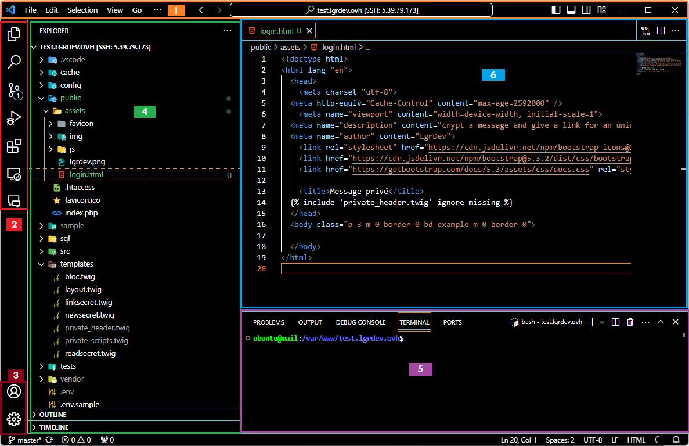

# Présentation de VSCode

## l'interface



1. Barre de menu avec la palette de commande
2. Zone de travail
3. Configuration et profil
4. Workspace
5. zones de terminal, debug,
6. Editeur de code

En base à gauche, les informations concenrnant votre projet

1. branche git
2. erreurs de code et avertissements
3. port concernant le debug


En bas à droite, informations concernant le formatage du code en cours d'édition

Attention, cette zone sera différente selon le langage en cours d'édition. Dans cet exemple, c'est un fichier html qui est en cours d'édition.

## les raccourcis VS Code


## Les extensions


### Il y a des extensions pour presque tout : 
Les langages : Php, Ruby, Javascript, Python, Typscript, C#, C++, Html, Css
Les utilitaires : TODO, Spellcheker, SSH, ...
Les frameworks : Symfony, Django

### Comment s'y retrouver :
* L'onglet **Recommended**
Selon le document sur lequel vous travaillez, il vous propose les extensions utilisables
* La zone de recherche : taper votre texte (exemple : SQL Server -> Sql Server (mssql))
* Le classement des extensions
Une extension utilisée par plus de 1 million d'utilisateur est surement mieux développée et plus utile que celle qui a 200 utilisateurs


### Comment l'installer ?
En selectionnant l'extension, son descriptif apparait : ce descriptif est généralement bien fourni et décrit aussi le paramètrage de l'extension. Le bouton "Install" vous permet d'installer l'extension.


## Configurer git
1. Ouvrir un terminal
2. Configurer votre adresse mail
```bash
git config --global user.email "user@domain.net"
```
3. Configurer votre username
```bash
git config --global user.name "yourusername"
```
4. Verifier votre configuration
```bash
git config --global --list
```

**Astuce :**
Vous pouvez avoir une configuration globale et une confguration locale de git.
La configuration globale est une configuration stockée au niveau des parametres utilisateurs. Pour Windows, voir le fichier : 
C:/Users/Username/.gitconfig

Configuration globale :
```bash
git config --global ......
```

La configuration locale est propre au repository sur lequel vous travaillez. Voir le fichier : C:/Users/MyProject/.git/config

Configuration locale au repository :
```bash
git config --local ......
```

