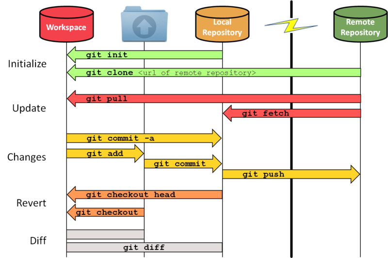

# Comment fonctionne Git ?


# Git Clone

La commande git clone est essentielle pour récupérer un dépôt Git existant depuis une source externe, telle qu'un dépôt distant sur un serveur Git, comme GitHub, GitLab ou Bitbucket. Elle permet de créer une copie locale complète du dépôt distant, y compris l'historique complet des versions et les fichiers du projet.

## Syntaxe de base
La syntaxe générale de la commande git clone est la suivante :

```bash
git clone <URL_du_dépôt> [<nom_de_dossier_cible>]
```
1. <URL_du_dépôt> : L'URL du dépôt Git distant que vous souhaitez cloner.
2. [<nom_de_dossier_cible>] (optionnel) : Le nom du dossier dans lequel le dépôt sera cloné. Si ce paramètre est omis, le dossier portera le nom du dépôt distant.

## Étapes pour utiliser git clone

### 1. Trouver l'URL du dépôt
Avant de cloner un dépôt, vous avez besoin de son URL. Vous pouvez la trouver sur des plateformes telles que GitHub, GitLab ou Bitbucket, souvent affichée à côté du bouton "Clone" sur la page du dépôt.

### 2. Ouvrir le terminal
Ouvrez un terminal ou une ligne de commande sur votre ordinateur.

### 3. Exécuter la commande git clone
Utilisez la commande git clone avec l'URL du dépôt pour effectuer le clonage. Par exemple :

```bash
git clone https://github.com/utilisateur/nom_du_depot.git
```

Cela va créer un dossier nommé nom_du_depot dans le répertoire actuel, contenant une copie de tous les fichiers et de l'historique du dépôt distant.

### 4. Vérifier le dépôt cloné
Une fois le processus terminé, vous pouvez naviguer dans le dossier cloné et vérifier son contenu à l'aide de la commande ls (sur Unix) ou dir (sur Windows) pour afficher les fichiers et dossiers.

## Options utiles
Cloner dans un dossier spécifique :
Si vous voulez spécifier un nom de dossier différent pour le dépôt cloné, vous pouvez le faire en ajoutant le nom du dossier à la fin de la commande git clone :

```bash
git clone https://github.com/utilisateur/nom_du_depot.git nom_du_dossier_personnalise
```

Cloner une branche spécifique :
Si vous souhaitez cloner seulement une branche spécifique du dépôt, vous pouvez le spécifier après l'URL du dépôt avec l'option -b :

```bash
git clone -b nom_de_branche https://github.com/utilisateur/nom_du_depot.git
```

Cloner un dépôt vide (sans historique) :
Si vous voulez uniquement les fichiers actuels sans historique, utilisez l'option --depth pour spécifier la profondeur du clonage :

```bash
git clone --depth 1 https://github.com/utilisateur/nom_du_depot.git
```

# Le clonage superficiel (shallow)
La commande git clone --depth est utilisée dans Git pour créer une copie superficielle (ou "shallow") d'un dépôt avec un historique limité. L'option --depth spécifie quelle partie de l'historique du dépôt récupérer lors du processus de clonage.

Lorsque vous clonez un dépôt Git sans spécifier --depth, Git récupère l'intégralité de l'historique du dépôt, y compris toutes les branches et tous les commits. Cet historique complet vous permet d'avoir accès à l'évolution complète du projet, y compris tous les commits, branches et tags.

Cependant, en utilisant git clone --depth <valeur_profondeur>, vous indiquez à Git de ne récupérer qu'un nombre limité de commits de l'historique du dépôt. Par exemple, git clone --depth 1 ne récupérera que le dernier commit de la branche par défaut (généralement master ou main) et ignorera les commits historiques du dépôt.

Ce clonage superficiel peut être avantageux dans certains scénarios :

1. Réduction de la taille du téléchargement : Cloner un dépôt avec un historique limité peut considérablement réduire la taille du téléchargement, surtout pour les projets volumineux avec un historique étendu. Cela peut être avantageux lorsque vous vous intéressez uniquement à l'état le plus récent du projet et que vous n'avez pas besoin de l'historique complet.

2. Clonage plus rapide : Récupérer un clonage superficiel est généralement plus rapide car il télécharge moins de commits et de fichiers. Cela peut être utile lorsque vous souhaitez rapidement mettre en place une copie locale à des fins de test.

**Cependant, notez les limitations des clonages superficiels :**

**Historique limité** : Étant donné que vous ne récupérez qu'un nombre limité de commits, vous n'aurez pas accès à l'intégralité de l'historique du dépôt. Les opérations qui dépendent des informations historiques, telles que git log ou la vérification des anciens commits, peuvent être restreintes ou pourraient ne pas fonctionner comme prévu.

**Restrictions lors du push** : Les clonages superficiels ont des limitations lors du push des changements vers le dépôt d'origine. Il se peut que vous deviez convertir un clonage superficiel en un clonage complet (git fetch --unshallow) avant de pouvoir pousser des changements dans certains cas.

*N'oubliez pas que bien que les clonages superficiels puissent être utiles dans des situations spécifiques, ils pourraient ne pas convenir si vous avez besoin de l'accès à l'intégralité de l'historique du dépôt pour des tâches telles que l'examen des modifications passées, l'analyse historique ou la collaboration sur des versions plus anciennes de la base de code.*