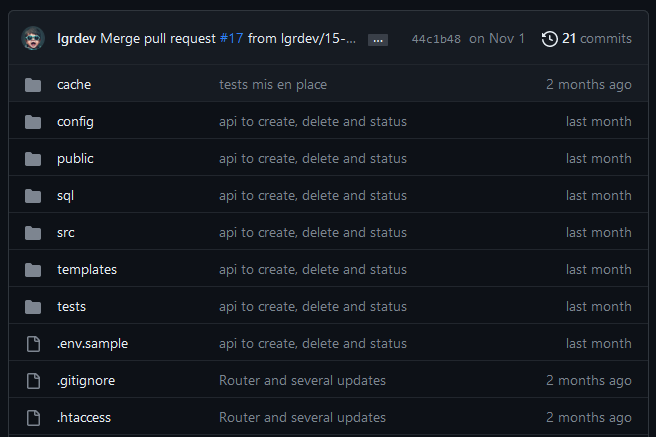

# Git Commit

La commande git commit  permet de sauvegarder les modifications apportées à votre dépôt Git, en créant des instantanés des changements effectués depuis le dernier commit. 

## Syntaxe de base
La syntaxe générale pour effectuer un commit avec Git est la suivante :

```bash
git commit -m "Message de commit"
```

-m "Message de commit" : C'est un paramètre utilisé pour ajouter un message décrivant les modifications effectuées dans ce commit. Ce message est essentiel pour expliquer la raison du commit et ce qu'il accomplit.

## Étapes pour utiliser git commit

### 1. Vérifier l'état des modifications
Avant de commiter, vous devez vérifier l'état de vos modifications. Utilisez la commande git status pour voir quels fichiers ont été modifiés depuis le dernier commit et quels fichiers sont en attente de commit.

### 2. Ajouter des fichiers à la zone de staging
Utilisez la commande git add pour ajouter les fichiers modifiés à la zone de staging (l'index) pour préparer le commit. Par exemple :

```bash
git add nom_du_fichier_modifié
```

### 3. Effectuer un commit
Ensuite, utilisez la commande git commit pour créer un commit avec les fichiers ajoutés à la zone de staging et un message décrivant ces modifications :

```bash
git commit -m "Message décrivant les modifications apportées"
```

Cela va créer un nouveau commit dans l'historique de votre branche, enregistrant les modifications que vous avez ajoutées à la zone de staging.

## Options utiles
**-a**  ou **--all**
Indique à la commande d’indexer automatiquement les fichiers qui ont été modifiés ou supprimés, mais les nouveaux fichiers dont vous n’avez pas signalé la présence à Git ne sont pas affectés.

**-m <msg>** ou **--message=<msg>**
Utiliser le <msg> fourni comme message de validation. Si plusieurs options -m sont fournies, leurs valeurs sont concaténées comme paragraphes séparés

**--amend**
Le développeur a oublié de créer un fichier, ou oublié un commentaire dans un fichier du commit précedent, ou ...
pour corriger le commit précedent, la commande **git commit --amend** annule et remplace le commit.

Conceptuellement, Git fera pour vous un pas en arrière puis un pas en avant. Il va revenir à l’état d’avant validation, donc avec nos fichiers stagés , et revalidera automatiquement avec tous les fichiers stagés (dont les nouveaux, si on avait ajouté au stage avant de lancer le --amend). En gros, il va annuler notre commit et en créer un nouveau à la place, nous permettant des modifications intermédiaires : ajout / retrait de fichiers, mise à jour du message du commit.

```bash
git commit --amend
```

## Comment modifier le message d'un commit
pour corriger le commit précedent, la commande **git commit --amend** annule et remplace le commit.

```bash
git commit --amend -m 'Nouveau Message'
```

## Le message est important ?
oui, car c'est une indication sur les modifications (ajout, suppression, modification) que vous avez effectuées lors du commit.


## Des messages normalisés
il est important, surtout quand on travail en équipe, d'avoir des messages normalisés, d'autant plus que vous travaillez avec Wrike ou Monday

si votre commit porte sur un bug #4123 dans Wrike, votre message pourrait être de la forme : **Fix: #4123 Debug fct calculeSomme**

Ci-dessous, un lien proposant une norme pour les commit. Cette norme doit être adaptée au fonctionnement de votre équipe. 
https://www.conventionalcommits.org/fr/v1.0.0-beta.2/#sp%c3%a9cification


## exemple pour des messages normalisés
```bash
git commit -m "Fix: Ajout client" -m "#4102 client non ajouté en bdd"
```