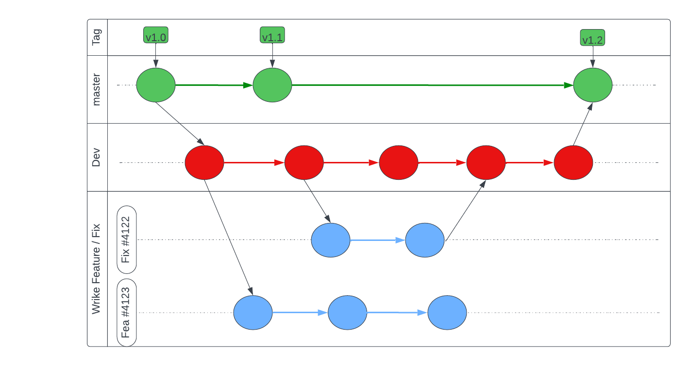
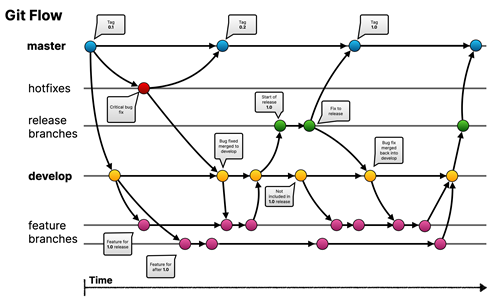
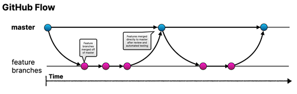

# Les branches

Une branche représente une ligne de développement indépendante. Les branches servent d'abstraction pour le processus d'édition/étape/validation. Vous pouvez les considérer comme un moyen de demander un tout nouveau répertoire de travail, une zone de préparation et un historique de projet. Les nouveaux commits sont enregistrés dans l'historique de la branche actuelle, ce qui entraîne une bifurcation dans l'historique du projet.

Généralement, un projet a plusieurs branches :
la branche master sert de branche principale
La branche développement sert aux développements en cours
Chaque user story ou chaque bug est développé ou corrigé dans sa propre branche

la gestion des branches dans Git, y compris les pratiques de fusion et de développement parallèle, peut varier en fonction des besoins spécifiques d'un projet et de son équipe de développement. Les recommandations et les bonnes pratiques peuvent servir de lignes directrices, mais elles ne sont pas nécessairement rigides ni universelles pour tous les scénarios.

La règle souvent citée, comme celle du "Gitflow" par exemple, est un modèle de flux de travail de gestion de branches qui propose une structure spécifique pour les branches (comme la branche principale, les branches de fonctionnalités, les branches de version, etc.). Cependant, ce modèle peut être adapté en fonction des besoins spécifiques d'un projet ou d'une équipe de développement.

Certains facteurs à considérer pour adapter les règles de gestion des branches dans Git peuvent être :

1. Taille de l'équipe : Une petite équipe peut avoir des besoins différents d'une équipe plus importante. Une plus grande équipe pourrait nécessiter une structure plus formelle des branches pour mieux gérer les modifications parallèles.

2. Nature du projet : Les projets variés, tels que les projets logiciels, les projets de données, les projets de conception, peuvent nécessiter des approches différentes en matière de gestion des branches en raison de leurs exigences spécifiques en termes de cycles de développement et de déploiement.

3. Méthodologie de développement : Les équipes qui utilisent des méthodologies de développement spécifiques, comme Agile ou DevOps, peuvent adapter les pratiques de gestion des branches pour s'aligner avec les principes clés de leur méthodologie.

4. Flexibilité : L'adaptabilité est une clé importante. Si une approche de gestion des branches ne fonctionne pas bien pour un projet ou une équipe, il est souvent judicieux d'expérimenter et d'ajuster les pratiques pour trouver ce qui convient le mieux.

## le workflow Gitflow
Le workflow Gitflow a tout d'abord été publié dans un billet de blog très médiatisé de 2010, par Vincent Driessen de chez nvie. Le workflow Gitflow définit un modèle de branches **strict** conçu autour de la version du projet. Il n'ajoute aucun nouveau concept ni aucune nouvelle commande en dehors de ce qui est exigé pour le workflow de branche de fonctionnalité. Il assigne plutôt des rôles très spécifiques aux différentes branches et définit comment et quand elles doivent interagir.
https://nvie.com/posts/a-successful-git-branching-model/

## le workflow GitHub
Le GitHub Flow est un modèle de flux de travail basé sur Git qui met l'accent sur la simplicité et la souplesse pour le développement logiciel. Conçu par GitHub, il vise à faciliter la collaboration et la livraison continue de code de qualité tout en maintenant un processus fluide.

Le GitHub Flow se concentre sur les étapes suivantes :

1. Brancher: Tout commence par la création d'une branche à partir de la branche principale (généralement "main" ou "master") pour travailler sur une fonctionnalité, une amélioration ou une correction de bogue spécifique.

2. Commits fréquents: Les développeurs effectuent des commits réguliers pour enregistrer les modifications apportées à la branche en cours de développement.

3. Pull Request (demande de fusion): Une fois que le travail sur la fonctionnalité est terminé (ou à un stade où il est prêt pour l'examen par les pairs), une pull request est ouverte. Cette demande compare les modifications apportées dans la branche avec la branche principale et permet à d'autres développeurs de passer en revue le code, de discuter des modifications et de les valider.

4. Code Review: Les pairs examinent le code et fournissent des commentaires, suggèrent des modifications ou approuvent la fusion.

5. Merge (Fusion): Une fois que la pull request a été approuvée et les problèmes identifiés ont été résolus, le code est fusionné dans la branche principale.

6. Déploiement: Une fois que le code est fusionné dans la branche principale, il peut être déployé vers l'environnement de production.

Le GitHub Flow encourage une approche itérative du développement où les changements sont fréquemment intégrés dans la branche principale après une revue par les pairs. Cela favorise une livraison continue et une réactivité aux changements, tout en maintenant un processus de développement contrôlé.

Ce modèle de flux de travail est simple, favorise la collaboration et est adapté à de nombreux types de projets. Cependant, comme pour toute méthodologie, il peut nécessiter des ajustements selon les besoins spécifiques de chaque équipe ou projet.

## Le workflow Sifa
cette partie reste à écrire (au sens propre). Seule l'experience vous permettra de choisir le meilleur workflow pour Sifa Logistics.

