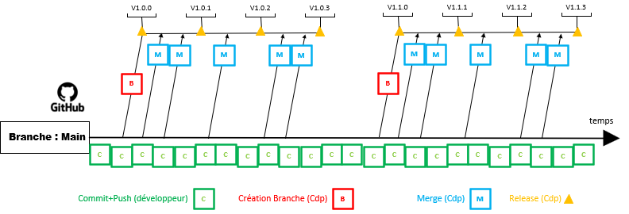

# Résumé des flows

## Le noflow
Cette méthode est la plus simple puisqu’il suffit de publier son travail sur la seul et unique branche existante par défaut : la branche **main** ou **master**

## Le GitFlow
Le principe de GitFlow est de fonctionner sur deux branches principales: la branche de développement (**develop**) et la branche de production (**main**)
Chaque nouvelle modification du projet doit être faite via des sous-branches, aux nombres de trois, qui sont ensuite fusionnées aux branches principales :

1. Pour ajouter de nouvelles fonctionnalités, il faut créer une branche feature”, elle sera ajoutée à la branche develop ou à une branche de release.
1. Si on souhaite fixer une erreur sur la branche master, il faut créer une nouvelle branche “hotfix”. Cette dernière sera fusionnés sur les deux branches principales.
1. Dès que l’on souhaite créer une release, on crée une branche “release” qui sert de branche principale aux nouvelles fonctionnalités de cette dernière. Lorsque la release arrive en production, les commits de cette branches sont rajoutés à la branche master ainsi qu’à la branche develop pour permettre de continuer aisément le développement des fonctionnalités sans problème majeur lors de futur fusion de branche.

La convention de nommage des sous-branches consiste à les nommer selon leur fonctionnalité première (“feature”, “hotfix”, “release”) suivi du numéro du ticket, ou son nom, ou sa fonctionnalité, etc… (example: “feature-1”).

## Le OneFlow
Le principe de fonctionnement de Oneflow est une amélioration de Git Flow, le changement majeur est qu’il n’existe pas de branche develop. Le principal avantage est d’avoir un historique git plus propre tout en conservant ceux de Git Flow.

## Le GitLab Flow
A l’inverse de tous les autres workflows, GitLab Flow a sa propre branche de production dont le dernier **commit** sur cette fameuse branche est la version actuelle du service. GitFlow est lui aussi est basé sur trois branches principales :

1. La branche master, qui représente l’environnement de développement.
1. La branche staging, qui représente le contenu de la version de pré-production.
1. La branche Production, qui est la version publiée sur les serveurs de production.

L’avantage d’utiliser ce workflow est qu’il est facilement possible de savoir les commits utilisés dans chaque environnement.

## Le GitHub Flow
Le site Github a implémenté le système de Pull Request en 2018. Cette ajout fut une révolution pour les projets **open-source** , permettant à un utilisateur de pouvoir fusionner son code dans une autre branche à la suite d’une validation manuelle d’une ou plusieurs personnes.
Github Flow place au coeur de son workflow le **Pull Request** . Le développeur crée une nouvelle branche sur laquelle il va faire ses modifications. Après avoir fini son développement, le développeur crée une **pull request**. Tant que la demande n’a pas été validée par l’équipe, le développeur peut modifier son code. Si l’équipe valide la modification, cette dernière est fusionnée au code principal. La branche principal du projet est donc fonctionnelle et livrable en production.

Cette méthode est principalement utilisée sur des projets avec de petites équipes.

## Le trunk Based Development
La différence majeure, entre le **trunk-based** et **Github Flow** , est que la branche master n’est pas considérée comme utilisable en production. Toutes les fonctionnalités sont ajoutées à la branche principale, et seuls les commits de corrections sont ajoutés à la branche de release (après avoir été ajoutés au trunk).
Cette pratique permet d’éviter d’avoir des conflits de **merge** et de permettre d’avoir un programme toujours compilable et fonctionnel.

# Conclusion 
**Ne vous lancez pas avec un flow sur un projet réel. Testez d'abord et choisissez le flow qui correspond à votre façon de travailler.**
