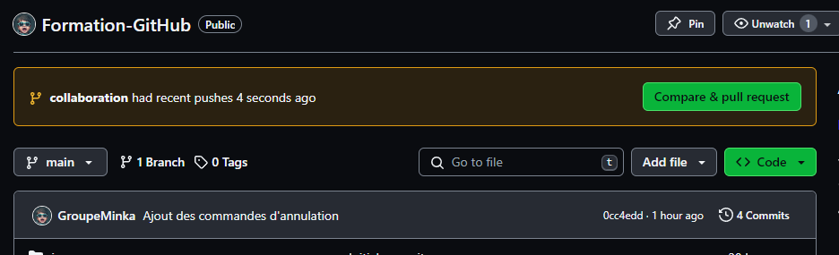
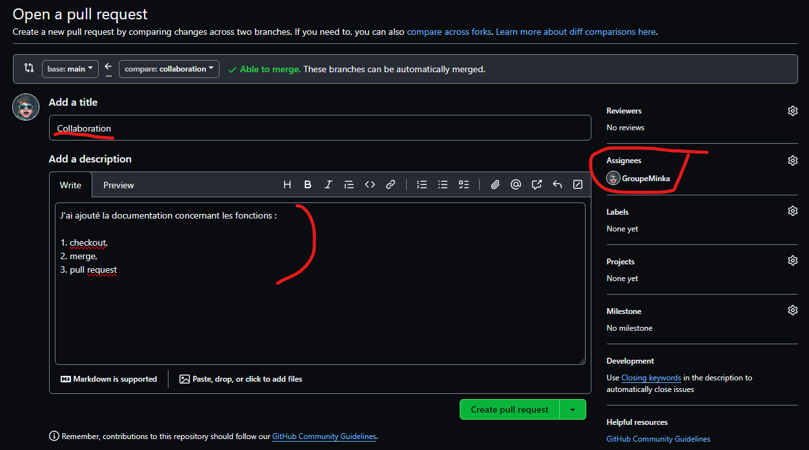
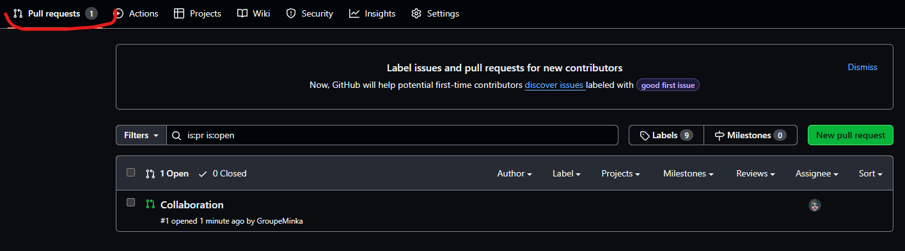
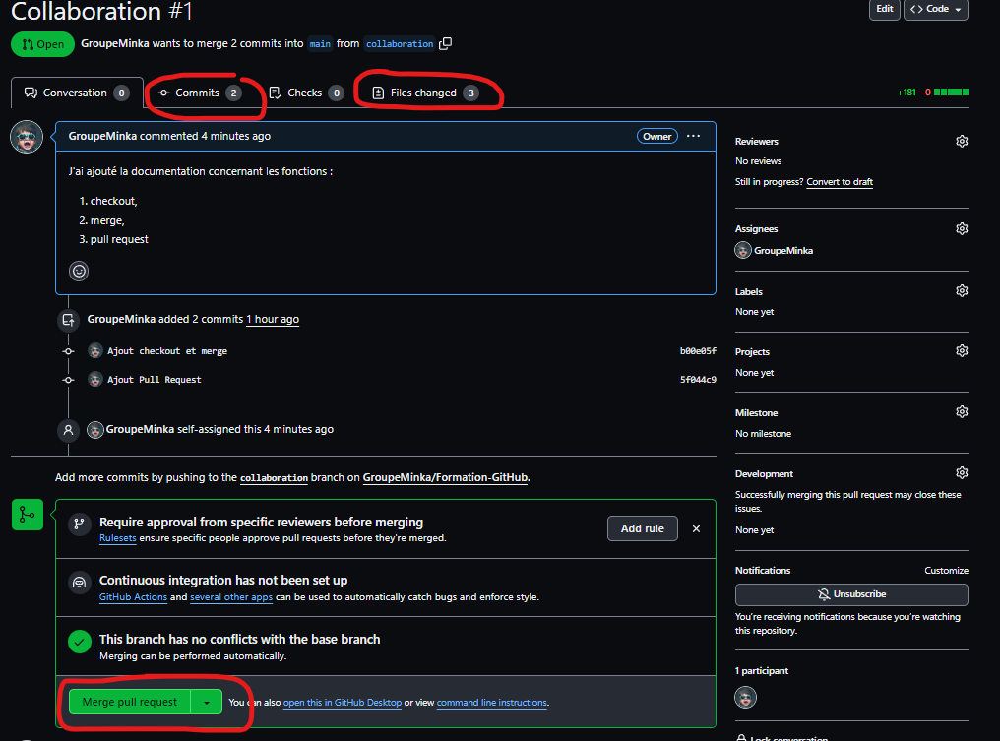
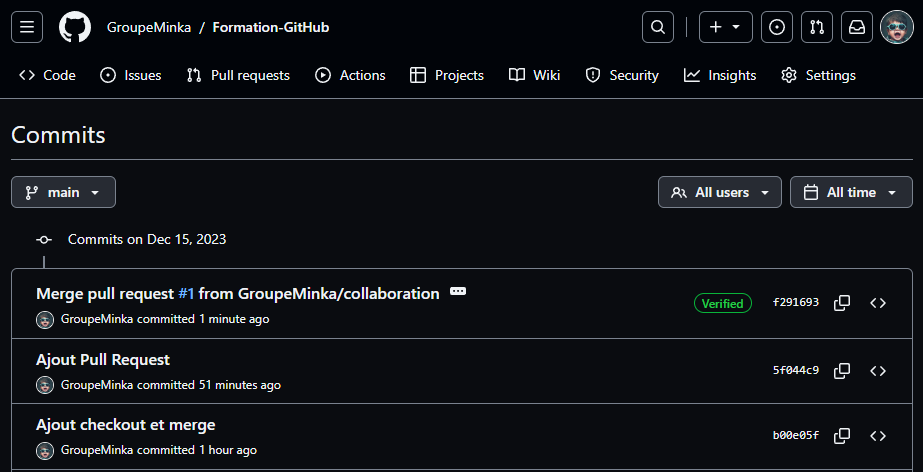

# Les pull Request avec VS Code

Quand vous faites un push depuis une branche dans Visual Studio Code, les commits en attente sont poussés vers GitHub

1. Sur le site GitHub, vous êtes avertis qu'une PR a été demandée.

2. Cliquer le bouton "Compare & pull request"

3. Remplir le formulaire et assigner un responsable, puis cliquer le bouton "Create pull request"

4. La liste des PR est maintenant alimentée.

5. Vous pouvez vérifier le code , vérifier les commits
Si tout est correct, vous pouvez "merger" la PR avec la branche principale.

6. Vos branches sont maintenant mergées. La branche "Features" peut maintenant être supprimée.
