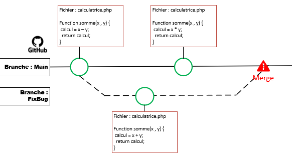
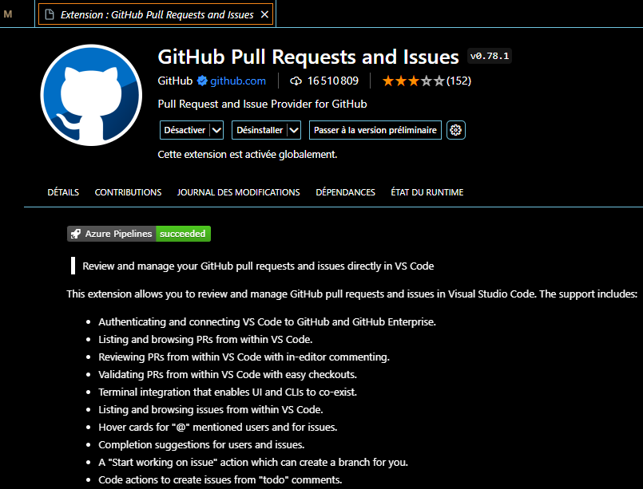

# Les conflits et comment les résoudre
Lorsque l’on travaille sur un projet en équipe, il est courant de rencontrer des conflits d’édition ou fusion de code. Et quelque part, cette situation est normale.

## Conflit ?

Définition par [Atlassian](https://www.atlassian.com/fr/git/tutorials/using-branches/merge-conflicts){:target="_blank"}  : 
Les conflits surviennent généralement lorsque deux personnes ont modifié les mêmes lignes dans un fichier, ou si un développeur a supprimé un fichier alors qu’un autre développeur le modifiait. 
Dans ces cas, Git ne peut pas déterminer automatiquement la version correcte. Les conflits n’affectent que le développeur qui effectue le merge, les autres membres de l’équipe ne sont pas conscients du conflit. 
Git marquera le fichier comme étant en conflit et arrêtera le processus de merge. Il incombe alors aux développeurs de résoudre le conflit.



## Les cas de conflit
1. **Modification concurrente** : quand plusieurs développeurs modifient la même ligne de code d’un même fichier et tentent de fusionner le changement sur une même branche ; quand les changements contenus d'un commit portent sur le même fichier ou ligne(s) de code.
2. **Suppression de code / fichier** : quand un développeur supprime un fichier (ou une ligne), qu’un autre développeur a édité ce fichier ou cette ligne, et que chacun des deux cherchent à fusionner sa modification sur une même branche.
3. **Déplacement ou renommage de fichier** : quand un développeur renomme ou déplace un fichier, pendant que dans le même temps, un autre développeur y a apporté des modifications
4. **Fusion de branches** : lorsqu’un développeur souhaite intégrer une branche sur une autre, toutes deux ayant subies des modifications aux mêmes endroits, ex : au moment de fusionner une pull request, opération consistant à réintégrer la branche Git correspondante sur la branche principale du repository.
4. **Rebasage de branche** : lorsque l’on effectue une opération de rebasage (“action consistant à décaler une série de commits”) sur une branche

## Comment éviter les conflits ?
1. **Utiliser les branches** : En utilisant des branches, on évite les conflits durant le développement des fonctionnalités => on se concentre sur le dev
2. **Synchroniser régulièrement** : il faut rebaser très souvent et très régulièrement sa branche ou son code avec la branche principale.
3. **Ne pas occulter un conflit** : le report à plus tard peut être plus gênant qu'autre chose.
4. **Commiter fréquemment** : moins de code modifié = moins de conflits possibles

## Pour vous aider :
L'extension "GitHub Pull Requests and Issues" :


## git rebase
**Tant que vous rebasez vos branches en local, tout va bien. Mais attention, si vous rebasez une branche qui se trouve déjà sur le serveur, c'est la catastrophe.**

Votre historique git est un peu comme un arbre, avec son tronc (la branche main), ses branches et ses sous-branches.
La commande **git rebase** permet de couper une branche pour la regreffer à un autre endroit sur l'arbre.

```
Main    A---B---C---D---E
            \
Fea141      F---G---H            
```

Quand on fait un **git merge** on obtient :
```
Main    A---B---C---D---E---I
            \               /
Fea141      F---G---H------            
```

En utilisant un rebase avant chaque fusion, on obtient l'historique suivant :
```
Main    A---B---C---D---E---F---G---H
       
```

Pour obtenir cet historique, les commandes git sont les suivantes :
```
1. git checkout Fea141
2. git rebase main Fea141
3. git checkout main
4. git merge Fea141
5. git branch -d Fea141
```

## Réparer un création de branche hasardeuse...
Pour corriger un bug en urgence, j'ai créé une branche Fix323 , mais au lieu de la créer depuis la branche main, (et oui, l'urgence engendre des problèmes) je l'ai créé depuis ma branche Fea141...
```
Main    A---B---C---D---E
            \
Fea141      F---G---H   
                 \                
Fix323              I---J
```
Je vais donc rebaser la branche Fix323 sur la branche main

```
git rebase Fea141 Fix323 --onto main
git checkout main
git merge Fix323
```

Et j'obtiens

```
Main    A---B---C---D---E---I---J
            \
Fea141      F---G---H   
```

La commande **git rebase Fea141 Fix323 --onto main** signifie :
1. Extrait la branche de Fea141 jusqu'à Fix323
1. "Colle" la sur main


**Tant que vous rebasez vos petites branches en local, tout va bien. Mais attention, si vous rebasez une branche qui se trouve déjà sur le serveur, c'est la catastrophe.**
