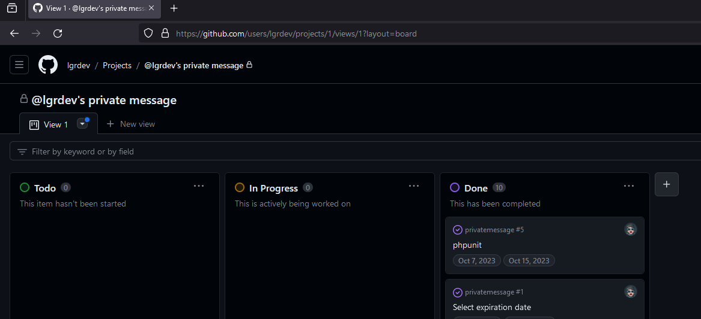
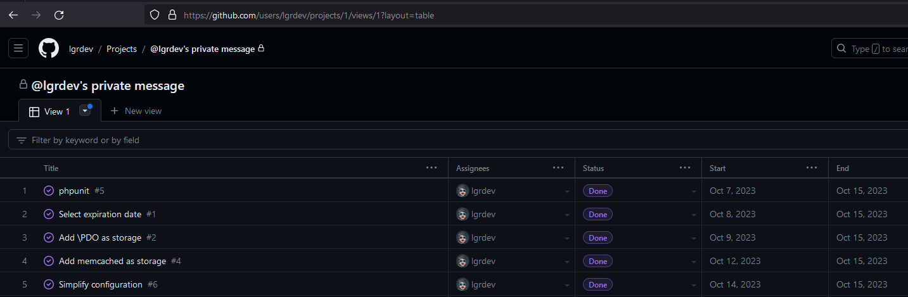
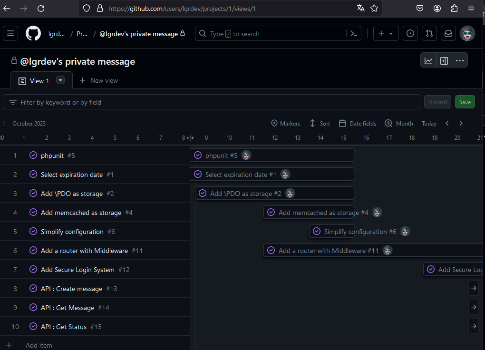

# Les projets GitHub
GitHub Projects sont des fonctionnalités intégrées de GitHub qui permettent aux équipes de gérer, organiser et suivre leur travail de manière plus structurée. Ils offrent un moyen de visualiser et de gérer les tâches, les problèmes, les fonctionnalités ou tout autre élément du projet, en les regroupant dans des tableaux kanban ou des listes.

1. **Gestion des tâches et des projets** : Les GitHub Projects permettent de créer des tableaux kanban avec des colonnes personnalisables (par exemple, "À faire", "En cours", "Terminé") pour suivre l'avancement des tâches et des problèmes.
1. **Organisation du travail collaboratif** : Les équipes peuvent facilement collaborer en attribuant des tâches, en commentant et en ajoutant des étiquettes pour organiser les problèmes ou les tâches.
1. **Visualisation de l'avancement** : Les tableaux kanban offrent une vue d'ensemble visuelle de l'état actuel du projet, montrant où se situent les différentes tâches ou fonctionnalités.
1. **Intégration avec d'autres fonctionnalités GitHub** : Les projets GitHub peuvent être liés à des référentiels (repositories), des problèmes, des pull requests, etc., ce qui facilite la navigation entre ces différentes parties du développement.
1. **Personnalisation et flexibilité** : Les utilisateurs peuvent créer des modèles de projets adaptés à leurs besoins spécifiques, avec des colonnes, des étiquettes et des filtres personnalisables.
1. **Suivi des progrès** : Les statistiques et les métriques intégrées permettent de suivre les performances individuelles, de l'équipe ou du projet dans son ensemble.

## Vue "Board"

## Vue "Table"

## Vue "Roadmap"

