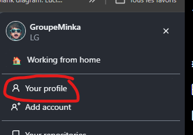
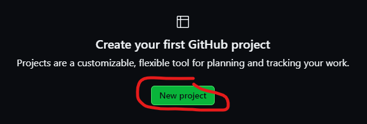
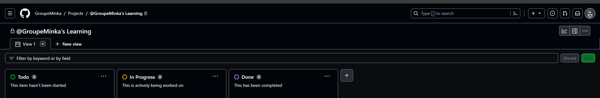

# GitHub Projects

## C'est quoi un project ?
Un projet est une liste de bugs, de fonctionnalités, de tâches et une feuille de route, qui intègrent vos problèmes et demandes de "pull request" sur GitHub pour vous aider à planifier et à suivre efficacement votre travail. 
Vous pouvez créer et personnaliser plusieurs vues en filtrant, en triant, en regroupant vos problèmes et demandes de tirage, visualiser le travail avec des graphiques configurables, et ajouter des champs personnalisés pour suivre les métadonnées spécifiques à votre équipe. 
Au lieu d’appliquer une méthodologie spécifique, un projet fournit des fonctionnalités flexibles que vous pouvez personnaliser en fonction des besoins et des processus de votre équipe.

## Création d'un projet (organisation ou personnel)

Les projets d’utilisateur peuvent suivre les problèmes et les demandes de "pull request" des dépôts appartenant à votre compte personnel.

1. Dans l’angle supérieur droit de GitHub.com, cliquez sur votre photo de profil, puis sur "**Votre profil**"

2. Dans le menu à gauche, cliquez sur "**Projects**"

3. Cliquez sur "**Nouveau projet**"

4. Sélectionnez un type de projet
5. Donnez un nom à votre projet, puis cliquez "**Create project**"

Votre projet est maintenant prêt.

