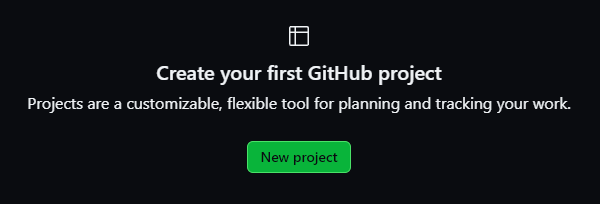
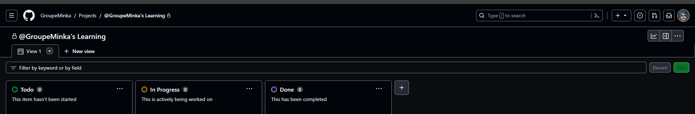

# Créer un projet dans GitHub

1. **Accédez à votre référentiel (repository) sur GitHub** : Connectez-vous à votre compte GitHub et ouvrez le référentiel (repository) où vous souhaitez créer le projet.

1. **Cliquez sur l'onglet "Projects" (Projets)** : Dans la barre de navigation de votre référentiel, recherchez l'onglet "Projects" et cliquez dessus.

1. **Créez un nouveau projet** : Sur la page des projets, vous verrez probablement une option pour créer un nouveau projet. Si vous n'avez pas encore de projet dans ce référentiel, vous verrez un bouton pour "Créer un projet". Cliquez dessus.

1. **Choisissez un modèle ou créez un projet vide** : GitHub propose des modèles préconfigurés (comme des tableaux kanban basiques) pour les projets. Vous pouvez choisir un modèle qui correspond à vos besoins ou créer un projet vide.

